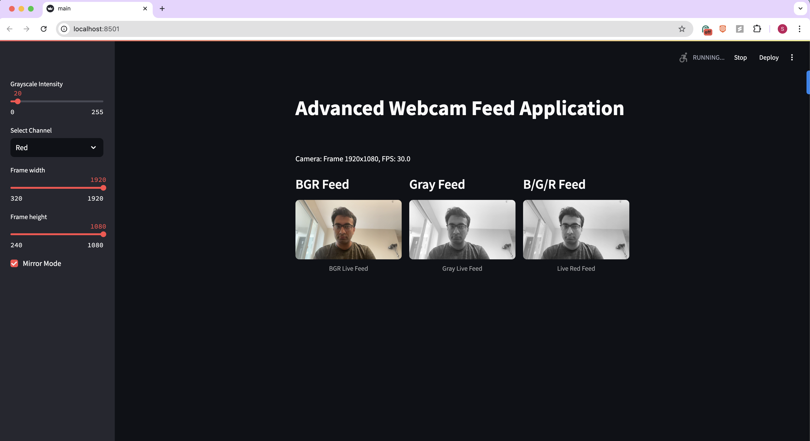

# Advanced Webcam Feed Application

## Overview

This Streamlit app provides real-time webcam visualization with multi-processing features. It offers a solution for monitoring webcam streams with interactive controls and robust processing.



## Features

### 🎥 Video Capture
- Real-time webcam feed capture
- Automatic detection of:
  - Frames per second (FPS)
  - Video source
  - Frame dimensions

### 🖥️ Multi-Channel Display
Simultaneous display of:
- Original BGR Image
- Grayscale Image
- Selected Color Channel (Blue/Green/Red)

### 🛠️ Interactive UI Controls
- Frame Dimension Modification
  - Width slider (320-1920 pixels)
  - Height slider (240-1080 pixels)
- Grayscale Intensity Slider
- Color Channel Selection
- Checkbox for Mirror mode

### 💾 Video Caching
- 30-second video stream cache
- Automatic fallback to cached frames if live feed is interrupted
- Cache status indicators in UI

### 🧵 Multi-Threading
- Parallel processing of:
  - Video capture
  - Frame processing
  - UI rendering

## Prerequisites

### System Requirements
The app is developed in the Apple Macbook Air(M2).
- Python 3.11+
- Webcam-enabled device

### Dependencies
- OpenCV (`cv2`)
- Streamlit
- Threading

## Installation

1. Clone the repository:
```bash
git clone https://github.com/satishsolanki1990/AdvancedWebcamFeedApp
cd AdvancedWebcamFeedApp
```

2. Create a virtual environment:
```bash
python3.11 -m venv env
source env/bin/activate  # On Windows, use `env\Scripts\activate`
```

3. Install required packages:
```bash
pip install -r requirements.txt
```

## Running the Application

```bash
streamlit run main.py
```

## Contact

Email: satishsolanki1990@gmail.com
